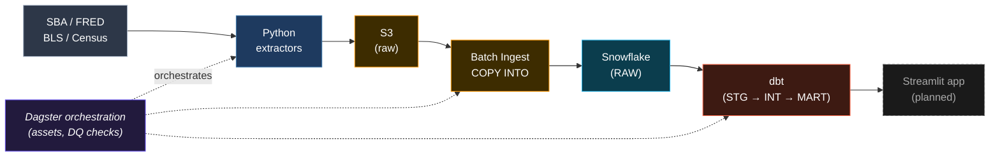

<h1 align="center">Small Business Lending Intelligence (SBLI) Pipeline</h1>

<p align="center">
  
  
  
  
  
  
</p>

An end-to-end analytics engineering project that ingests the full public record of SBA
small-business lending, enriches it with the U.S. macroeconomic environment at each loan's
origination, and answers a question a bank's credit officer actually asks:
**were these loans underwritten in a disciplined environment, or a dangerous one?**

The pipeline runs on a modern data stack — Python extractors → S3 → Snowflake → dbt —
fully orchestrated in **Dagster**, with data-quality checks gating ingestion and **250
data tests** validating every transformation.

> [!IMPORTANT]
> **Headline finding.** SBA loans originated in **2007 defaulted at 31.7%** — versus just
> **4.9%** for the **2012** vintage, a **6.5× gap**. The boom-era loans weren't doomed by the
> economy they lived through; they were doomed by the *loose lending standards they were
> underwritten under*. **Underwriting discipline at origination predicts defaults better than the
> macro climate that follows.**

---

## 🏗️ Architecture



**Flow:** four Python extractors pull from public APIs/FOIA files and land raw data in S3.
Snowflake ingests those files with `COPY INTO` (via an IAM storage integration — no credentials
in the pipeline). dbt transforms RAW → staging → intermediate → marts. **Dagster orchestrates the
entire graph as connected assets** — extractors, RAW loads, and dbt models — with data-quality
asset checks gating each extractor and 250 dbt tests validating every model.

---

## 🧱 What's in the box

| Layer | Tech | What it does |
|---|---|---|
| **Extract** | Python (`requests`, `boto3`) | 4 extractors (SBA, FRED, BLS, Census BFS) → raw files in S3 |
| **Ingest** | Snowflake `COPY INTO` + storage integration | S3 → Snowflake RAW, run server-side (no local download) |
| **Transform** | dbt (Snowflake, key-pair auth) | 17 models across staging → intermediate → marts |
| **Orchestrate** | Dagster (`dagster-dbt`, `dagster-snowflake`) | One connected asset graph, extractor → marts |
| **Quality** | Dagster asset checks + dbt tests | DQ checks on ingestion; 250 dbt tests on transformations |

---

## 📊 The data

| Source | What | Grain / volume |
|---|---|---|
| **SBA 7(a) & 504 FOIA** | Loan-level lending records since 1991 | ~2.17M loans (7(a) ~1.95M, 504 ~227K) |
| **FRED** | Macro series (fed funds, Treasury, unemployment, CPI, recession probability, SLOOS lending standards) | 8 series |
| **BLS** | Labor-market series | 6 series |
| **Census BFS** | Weekly business-formation applications | US / region / state |

The macro data is the differentiator: it's joined to each loan cohort **at the loan's origination
date**, so every SBA loan carries the economic context it was born into — enabling vintage-level
risk analysis instead of a static loan tape.

---

## 🎯 Marts

Four analytics-ready fact tables, each answering a class of credit-risk question:

- **`fct_loans_with_macro_context`** — loan cohorts joined to the macro environment at origination.
  The headline vintage/lending-standards analysis lives here.
- **`fct_loan_performance_by_industry`** — default and charge-off performance at 6-digit NAICS grain
  (fine enough to separate, e.g., B&B inns from snack bars within Food Services).
- **`fct_loan_performance_by_geography`** — performance by state, with Census-region rollups.
- **`fct_lender_performance`** — originator-level benchmarking (volume vs. true default rate).

A **"true default rate"** is used throughout: `(charged_off + sba_purchased) / total_loans` — because
an SBA loan's loss often shows up as a guarantee purchase rather than a charge-off, so counting only
charge-offs would understate real defaults.

---

## 📁 Case study

**[`docs/case_study_pioneer_valley.md`](docs/case_study_pioneer_valley.md)** frames the whole pipeline
as a solution: a fictional community bank's new Chief Credit Officer brings five real questions, each
answered by a working query against the marts (runnable companion: `case_study_pioneer_valley.sql`).
It's the fastest way to see *why* this pipeline matters, not just how it's built.

---

## 🗂️ Project structure

<!-- confirm this matches the real repo layout -->
```
.
├── fred.py  bls.py  census.py  sba.py          # extractors (API/FOIA → S3)
├── *_dq_script.py                              # per-source data-quality checks
├── snowflake_setup/                            # COPY INTO / stage / storage-integration SQL (01–07)
├── models/
│   ├── staging/                                # 1:1 cleaned views over RAW (+ sources.yml)
│   ├── intermediate/                           # unified SBA loans, macro spine
│   └── marts/                                  # the four fact tables
├── sbli_orchestration/                         # Dagster project
│   └── src/sbli_orchestration/defs/
│       ├── extractors/                         # extractor assets, DQ checks, RAW-load assets
│       ├── dbt_sbli/                           # dbt project as Dagster assets
│       └── shared_resources/                   # Snowflake resource
└── docs/                                       # case study, decisions doc
```

---

## 🔑 Key engineering decisions

- **"Raw is sacred."** Extractors write canonical (un-dated) S3 keys and overwrite in place; all
  renaming, typing, and JSON flattening happens in dbt staging, never in RAW.
- **COPY INTO over Snowpipe.** Loads run server-side via a Snowflake storage integration, so the
  orchestrator needs no AWS credentials and large SBA files never touch the local machine.
- **Key-pair (JWT) auth end-to-end** for both dbt and the Dagster Snowflake resource.
- **One connected asset graph.** dbt `sources.yml` maps each RAW table to its upstream Dagster load
  asset (`meta.dagster.asset_key`), so lineage flows unbroken from extractor to mart. Census, which
  loads four tables in one step, is modeled as a Dagster multi-asset.
- **Quality is layered.** Dagster asset checks validate each extract *before* it loads (file present,
  sane row counts, schema intact); 250 dbt tests validate every transformation. A range test on the
  FRED recession-probability column documents and guards its 0–100 scale.

See **[`docs/project_decisions.md`](docs/project_decisions.md)** for the full architecture-decisions
writeup.

---

## ✅ Status & roadmap

**Built and working:**
- [x] Four Python extractors → S3, each with a data-quality check
- [x] Snowflake RAW ingestion via `COPY INTO` + storage integration
- [x] Full dbt project — staging → intermediate → marts (17 models, 250 tests)
- [x] Dagster orchestration — extractors, RAW loads, and dbt as one connected asset graph
- [x] Data-quality asset checks gating ingestion
- [x] Pioneer Valley case study (narrative + runnable SQL)

**Next:**
- [ ] Streamlit app over the marts (the diagram's final box)
- [ ] CI (GitHub Actions: dbt lint + compile)
- [x] Group dbt assets by layer in the Dagster UI (staging / intermediate / marts)

> [!NOTE]
> **On scheduling.** A production deployment would define a daily Dagster schedule and run the
> dagster-daemon on an always-on host. Running locally, the pipeline is refreshed on demand through
> the Dagster UI — a deliberate choice, since a laptop isn't a persistent scheduling host.

---

## ▶️ Running it

<!-- confirm / flesh out to match your actual setup -->
Requires: a Snowflake account with key-pair auth configured, an S3 bucket, and API keys for FRED/BLS.

```bash
# dbt (from repo root)
uv run dbt build

# Dagster UI
cd sbli_orchestration
dg dev          # then open http://localhost:3000
```
